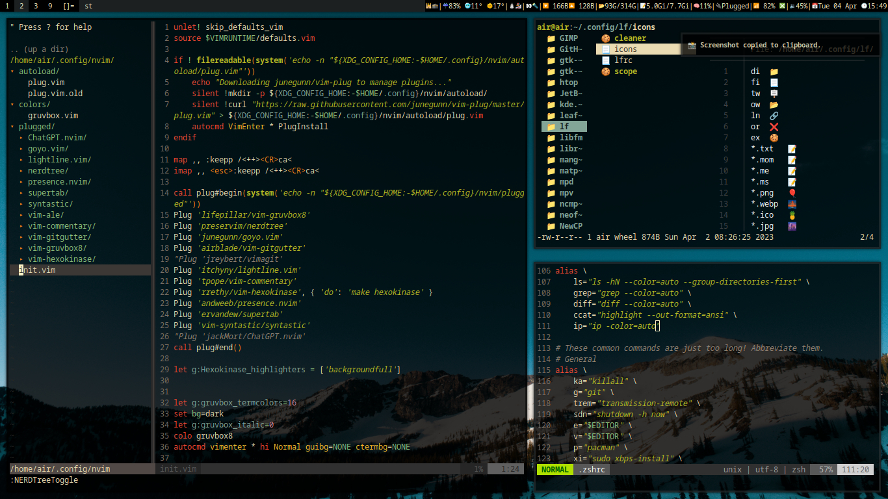

# dotfiles
The used Window Manager([dwm](https://github.com/hamedxyz/dwmblocks)), Terminal Emulator([st](https://github.com/hamedxyz/st)) and Status Bar([dwmblocks](https://github.com/hamedxyz/dwmblocks)) are not included here, each have their own repository(just click on them), as they include the source code and the build files for the individual programs themselves, so in order to have the full setup you would NEED them all.
My dotfiles, mainly:
- Configs for:
  - Zsh, aliases and other very neat settings imo
  - Nvim (with plugins), and again neet aliases i made
  - X11 and more..
- Scripts such as:
  - Status bar ([dwmblocks](https://github.com/hamedxyz/dwmblocks))
  - Wallpaper Randomizer, THE BEST screenshotting utilities that exists anywhere imo
  - Dmenu scripts, Very useful, im Always making more and Always improving them 
  - Other scripts taken and edited to suit me from [Luke Smith](https://github.com/LukeSmithxyz)
## Preview
Theme: Black+[Gruvbox](https://github.com/morhetz/gruvbox)




## Installation
To have this setup on arch linux distros you could use my [archinstall script](https://github.com/hamedxyz/archinstall)
check the README.md for more details
```
git clone https://github.com/hamedxyz/dotfiles
```
or you can just clone it take whatever interests you obviously
